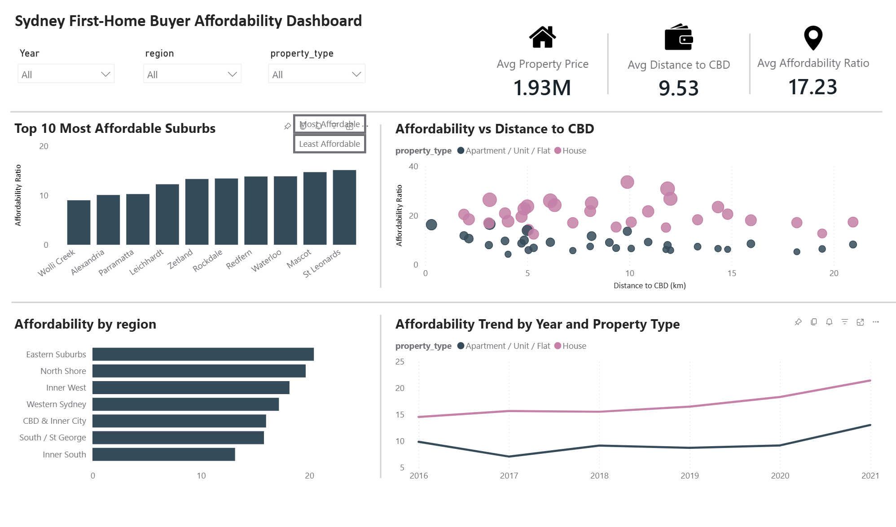

# 🏡 Sydney First-Home Buyer Affordability Dashboard


This project explores first-home buyer affordability across selected Sydney suburbs (2016–2021) by combining property transaction data, ABS household income data, custom region mapping, and interactive Power BI visualisations.

The goal was to build a practical, decision-support dashboard that helps compare **property price, affordability, distance to CBD, and suburb-level patterns** across selected Sydney residential areas.

---

## 📂 Project Structure

* 📄 `data_preparation.sql` — SQL query used to join and prepare the analysis-ready dataset.
* 📊 `detail_clean.csv` — Final transaction-level dataset used in Power BI.
* 📁 `domain_properties.csv` — Raw property transaction dataset used as the primary source table.
* 📁 `regions.csv` — Custom suburb-to-region mapping table.
* 📁 `income_data.csv` — Suburb-level ABS weekly household income data.
* 📈 `sydney_affordability.pbix` — The interactive Power BI dashboard file.
* 🖼️ `dashboard_overview.png` — Dashboard screenshot.

---

## 🧩 Data Preparation in SQL

To prepare the final analysis-ready dataset, I used SQL to combine raw property transactions with two supporting tables (custom **Sydney region mapping** and suburb-level **ABS weekly household income**). This enriched each transaction with location grouping and affordability context.
Key steps implemented in `Data_Cleaning.sql`:

### 1️⃣ Select the core transaction fields
First, I selected the raw property-level fields needed for analysis, including date, suburb, property type, price, CBD distance, and property attributes.
```sql
SELECT
    d.date_sold,
    d.suburb AS suburb,
    d.type AS property_type,
    d.price AS price,
    d.km_from_cbd AS km_from_cbd,
    d.num_bed,
    d.num_bath,
    d.num_parking,
    d.property_size
FROM domain_properties d

```

### 2️⃣ Add custom Sydney region mapping
Next, I joined the raw property data with a custom regions.csv table to group selected suburbs into broader Sydney regions such as Inner West and North Shore. This made it possible to compare affordability at both the suburb and regional levels.

```sql
JOIN regions r
    ON TRIM(LOWER(d.suburb)) = TRIM(LOWER(r.suburb))

```

### 3️⃣ Add ABS household income data
I then joined suburb-level ABS weekly household income data to provide an economic context for each suburb. This was an important step because the raw property dataset alone did not contain a suitable household affordability measure.

```sql
JOIN income_data i
    ON TRIM(LOWER(d.suburb)) = TRIM(LOWER(i.suburb))

```

### 4️⃣ Calculate annualised household income
Because the ABS data was collected as weekly household income, I annualised it by multiplying by 52 to create a more interpretable income base.

```sql
ROUND(i.weekly_household_income * 52, 0) AS estimated_annual_household_income

```

### 5️⃣ Create the affordability ratio
Using property price and annualised household income, I created a custom affordability metric to compare how many times annual household income is needed to match the transaction price.

```sql
ROUND(1.0 * d.price / (i.weekly_household_income * 52), 2) AS affordability_ratio

```

### 6️⃣ Filter to relevant and valid records
Finally, I filtered the dataset to keep only relevant residential property types and remove records with missing or invalid price/income values, ensuring a clean dataset for the dashboard.

```sql
WHERE d.type IN ('House', 'Apartment / Unit / Flat')
  AND d.price IS NOT NULL
  AND d.price > 0
  AND i.weekly_household_income IS NOT NULL
  AND i.weekly_household_income > 0

```

---

## 🧹 Data Cleaning in Power Query

Additional transformation steps were completed within Power BI to refine the dataset:

* 📅 Corrected date parsing issues caused by `dd/m/yy` formatting and rebuilt a valid `sold_date` field.
* ⏳ Added a year column for filtering and trend analysis
* 🚫 Removed extreme / unrealistic records
* 🔢 Checked data types across price, affordability ratio, and numerical property fields
---

## 📊 Dashboard Overview

The Power BI dashboard was designed as an interactive overview page with:

* Year, Region, and Property Type slicers
* KPI cards for average price, affordability ratio, and distance to CBD
* A Top 10 suburb affordability ranking
* A region-level affordability comparison
* A scatter plot of affordability vs distance to CBD
* A trend chart by year and property type
* Bookmarks and action buttons to switch between most and least affordable suburbs

---

## 💡 Key Insights

* 🚨 **Affordability pressure remains high across the selected market:** Across the selected Sydney suburbs, the average affordability ratio is 17.23, showing that first-home buyers still face substantial price pressure even before narrowing the analysis by property type.
  
* 🏘️ **Houses are consistently less affordable than apartments:** When filtered to houses, the average property price rises to $2.17M and the affordability ratio increases to 19.41. By contrast, apartments/units show a lower average price ($1.17M) and a lower affordability ratio (10.34), suggesting that property type plays a major role in entry affordability.
  
* 🎯 **Some suburbs appear to offer a stronger balance between affordability and location:** Based on the suburb ranking and scatter plot, areas such as Wolli Creek, Alexandria, and Parramatta appear to provide a relatively better balance between affordability and access, while higher-premium suburbs such as Burwood, Strathfield, and North Sydney remain much less affordable.
  
* 📈 **Affordability pressure has increased over time, especially for houses:** The trend chart suggests that affordability pressure for houses rose steadily between 2016 and 2021, with a clearer upward movement after 2020. Apartments/units remained more affordable throughout the period, although their affordability ratio also increased by 2021.
  
---

## 🛠️ Skills Demonstrated

* 🔗 **SQL Data Integration:** Multi-table `JOIN`s, string manipulation (`TRIM`, `LOWER`), and data filtering.
* 🧮 **Data Engineering:** Custom metric creation (Affordability Ratio) and annualized income calculation.
* 🧹 **Data Cleaning:** Null handling, outlier removal, and date parsing via Power Query.
* 📈 **Data Visualization:** Interactive Power BI design, DAX KPIs, Bookmarks, and Cross-filtering.
* 🧠 **Business Acumen:** Translating raw datasets into actionable decision-support insights.

